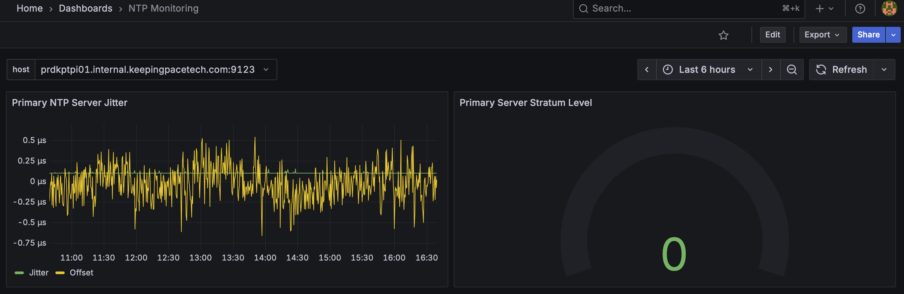

# chrony-prometheus-exporter

### Background

This is tested with Raspbian bookworm with chrony 4.3. 

This python code will scrape, parse, and normalize data for the primary NTP selected source and runs a web server on port :9123 to allow prometheus to scrape the stats



### Install:

Clone the project to a directory. Included is python file "chrony-export.py" and a systemd file. 

1. Copy the python file to /usr/local/bin (Assuming this is in system's path)

```sudo cp chrony-export.py /usr/local/bin/```

2. Copy the chrony-export.service file to /etc/systemd/system/chrony-export.service

```cp chrony-export.service /etc/systemd/system/```

3. Install prometheus python package

```sudo apt install python3-prometheus-client```

4. Reload daemon/enable service/start and check status

```
sudo systemctl daemon-reload
sudo systemctl enable chrony-export.service
sudo systemctl start chrony-export.service
sudo systemctl status chrony-export.service
```

5. Import Grafana dashboard

Use the grafana.json file to import the dashboard built. This assumes there is a working prometheus instance connected to grafana as a data source. 